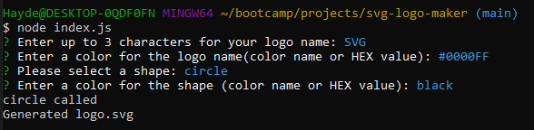

# SVG-Logo-Maker
  

  ## Description
  app to easily create SVG logos

  ## Table of Contents
  - [Installation](#installation)
  - [Usage](#usage)
  - [License](#license)

  
  

  ## Usage
  Run the application by typing node index.js into shell. You will then be prompted to enter a logo name, name color, select a shape, and enter a shape color. The application will take the user input and turn it into a SVG logo stored in the examples directory.

  ## License
  This README generator is licensed under the [MIT License](https://opensource.org/licenses/MIT)
  

  ## Badges
  

  ## Contribute
  

  ## Tests
  Tests cover the render() function of the individual shape classes, comparing the output to expected output.

  ## Questions
  Feel free to reach out and contact me with any questions you may have.
  - GitHub: [KyleH-Git](https://github.com/KyleH-Git)
  - Email: dahaydnator@gmail.com
